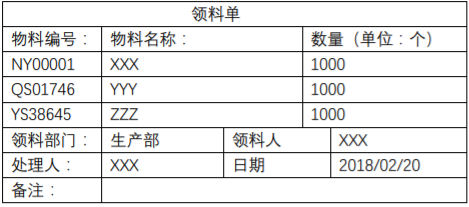
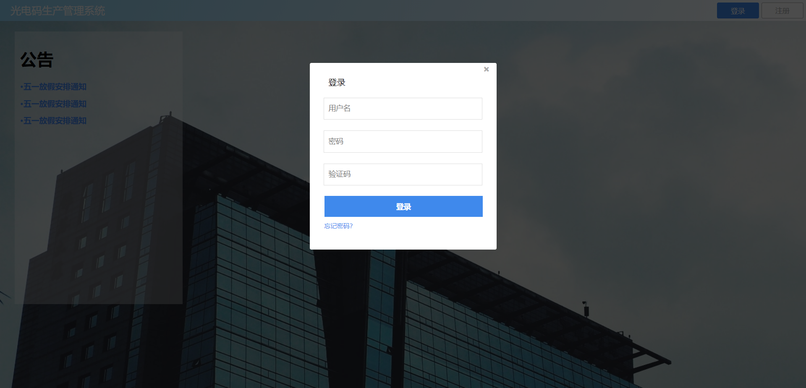
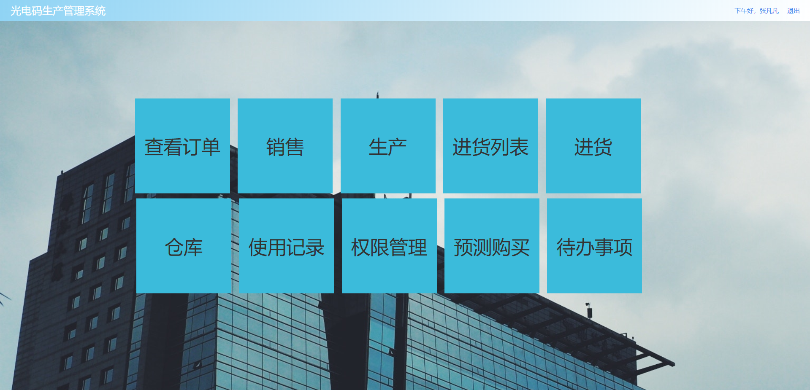
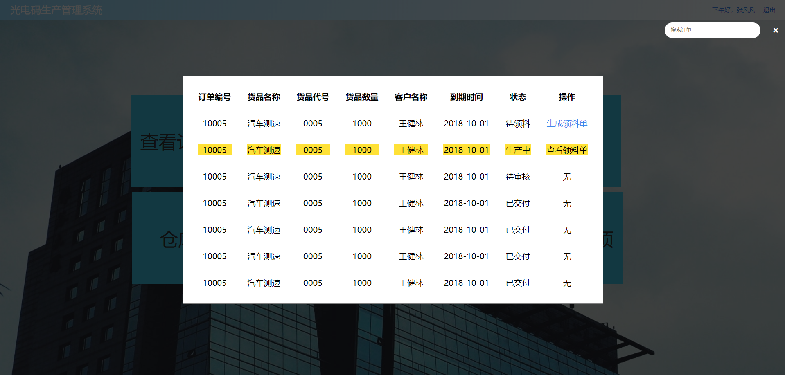

#需求分析
*************************
##需求文档
###一、 光电码盘生产管理系统
* 该系统是致力于提升光电码盘生产效率和节约生产以及管理成本的在线信息管理系统。

###二、 系统功能
1. BOM 信息维护
2. 仓库管理
3. 生产管理
4. 成本管理
5. 采购辅助管理
6. 个人信息管理

###三、 系统性能
1. 稳定性
2. 安全性

###四、 系统优势
1. 极大节约人力成本
2. 节约生产成本
3. 提高生产效率
4. 数据信息可维护性增强

*************************

##数据信息表
* #####订单录入

* #####领料单

* #####入库单

* #####采购单

* #####库存情况

* #####人员信息

*************************

#原型图
*************************
* #####原型主页

* #####原型登录

* #####原型系统

* #####原型查看订单

*************************

#ER模型图
*************************
####概览
